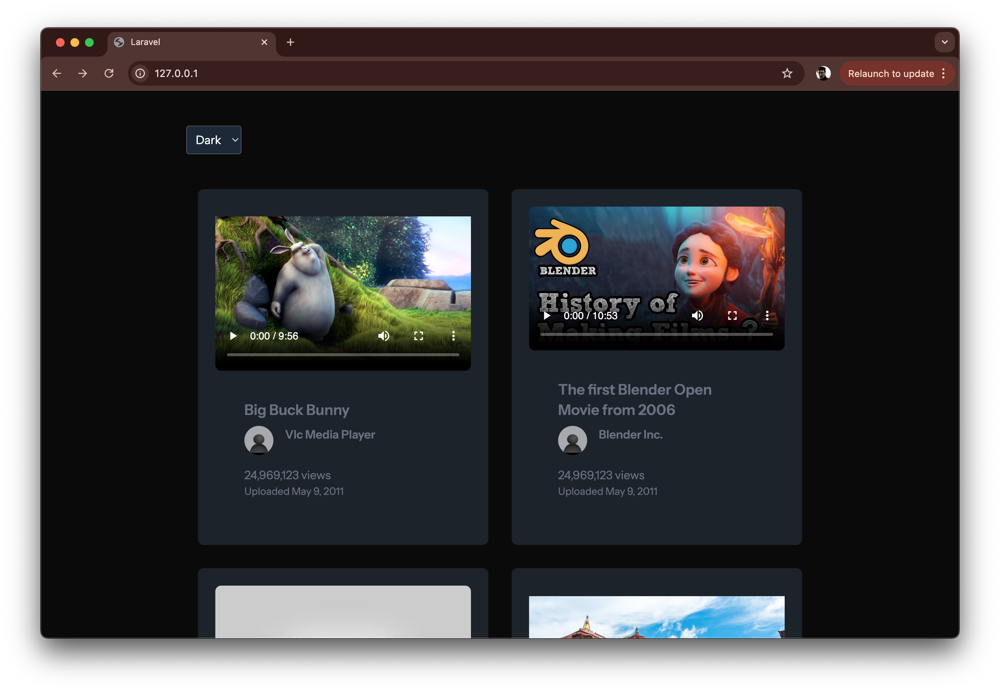

## VideoGrid

VideoGrid is a simple video grid component with play / autoplay / preview image functionality. 
Both the Grid and the Player are React based and responsive. It has been built with
- [Laravel 12](https://laravel.com/docs/12.x/releases)
- [React 18](https://react.dev/blog/2022/03/29/react-v18)
- [Tailwind CSS](https://tailwindcss.com/)
- [React Player](https://www.npmjs.com/package/react-player)

In addition, it makes use of [Docker](http://docker.io) through Laravel Sail

## How to run
Simply clone the rep into a folder, change dir to, e.g. `cd ./videogrid` and run `./vendor/bin/sail up`.
You should now be able to see it in your browser at http://127.0.0.1

## Prerequisites
- PHP 8.3+
- Docker

## NB
- No https has been configured for the purpose of this exercise
- I ~~will~~ use Axios to feed React, but in all truth I shouldn't need to, it'd be faster to just use Laravel Blade
- I have just noticed some duplicates, e.g. "The first Blender Open Movie from 2006" with an `isLive` status set to true and false respectively (ID's 7 and 8). I presume I have to d something clever here - working on it 

## License

The Laravel framework is open-sourced software licensed under the [MIT license](https://opensource.org/licenses/MIT).
